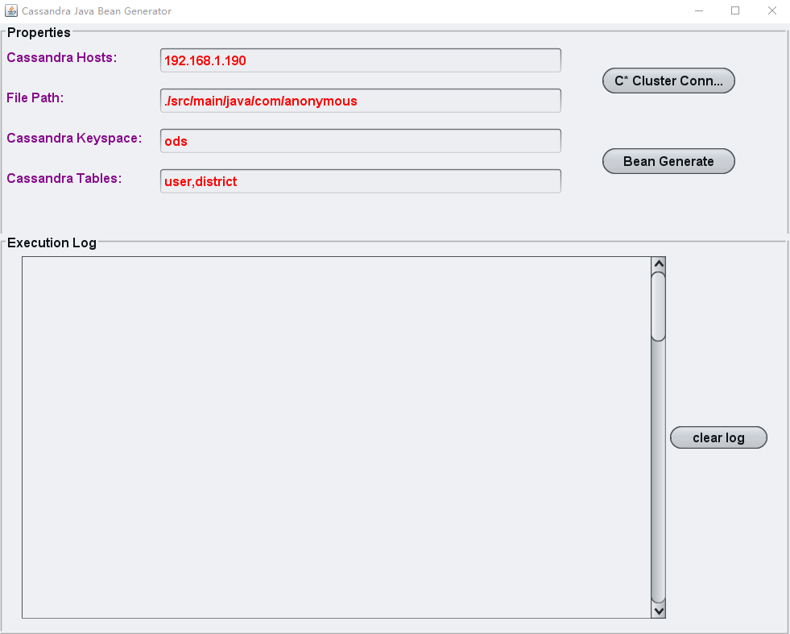

## CassandraBeanGenerator
Generating Java Beans relate to C* tables for rest apis.

#### Description
A little tool developed by Java Swing to generate JAVA beans related to Cassandra tables.
Generated Java beans contain JSON and swagger doc annotations.

#### Usage
1. Input your own cassandra contact point
2. Input your file generate path, the parent package of your project
3. Input your C* keyspace where the target tables in
4. Input the table names which the Java beans related to

 